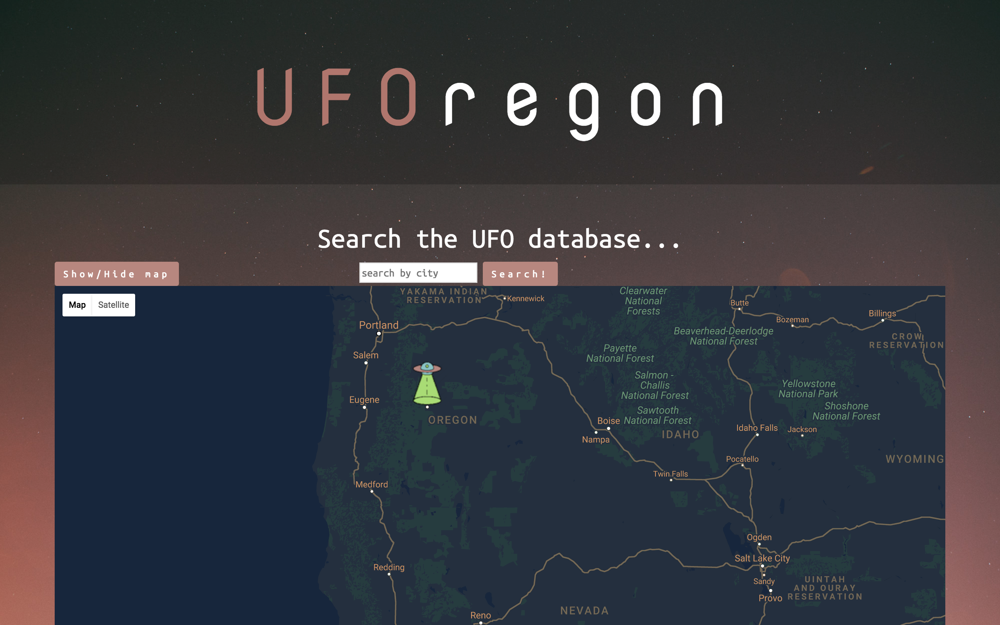

# UFOregon


This application uses data from the National UFO Reporting Center (NUFORC) database @ http://www.nuforc.org to show on a Google Map all of the locations where a UFO sighting has been reported in the state of Oregon. Upon clicking the marker information about the different sightings will be available.

## Screenshot



## Built With

* ActiveRecord
* Bootstrap
* CSS
* HTML
* Postgres
* Rake
* Ruby
* Sinatra
* Javascript
* JSON
* Google Maps API
* Heroku

### User Stories

As a user, I want to see a map of Oregon.
As a user, I want to search for a city in Oregon to see its reported UFO sightings.
As a user, I want to see more information about the sightings that have been reported there.
As a user, I want to see an indicator that shows which city's sighting information I am currently viewing with a marker on the map.


## Specifications

| Behavior | Input | Output |
|----------|:-----:|:------:|
| view map of Oregon  | user navigates to home page | map of Oregon loads with a marker indicating the center of the map |
| enter a city name to see a marker for that city | "Portland" | marker drops on Portland |
| click UFO marker for a city to see more details | click UFO on Portland | A list of all of the descriptions of each unique sighting in that city shows below the map |


## Setup/Installation Requirements
1. ⌘Command T to open a new tab in the terminal and start postgres (leave it running in the background)
```
$ postgres
```
2. Clone this repository in the terminal
```
$ git clone https://github.com/saschultz/UFOregon.git
```
3. Make sure you have rake installed
```
$ gem install rake
```
4. Navigate to the project directory
```
$ cd Desktop/UFOregon
```
5. In the terminal
```
$ rake db:schema:load
```
6. Open the project in a text editor of your choice
```
$ atom .
```
7. Prepare the database
```
$ rake db:create
$ rake db:migrate
$ rake db:test:prepare
```
8. In psql navigate to the oregon_sightings_development database and copy in the database file
```
$ psql

\c oregon_sightings_development

COPY ufos(sight_date, city, state, shape, duration, summary, latitude, longitude) FROM '/Users/Guest/desktop/UFOregon/raw_data/oregon_sightings_latlong.csv' DELIMITER ',' CSV;
```
9. ⌘Command T to open another new tab in the terminal and start sinatra (leave it running in background)
```
$ ruby app.rb
```
10. Navigate to localhost:4567 in a web browser of your choice

## Known Bugs
*

## Authors

Jin Camou, Dominic Brown, Sara Schultz, Dana Weiss

## License

*open source GPL & MIT*

```
Copyright (c) 2017 **Jin Camou, Dominic Brown, Sara Schultz, Dana Weiss**
```
